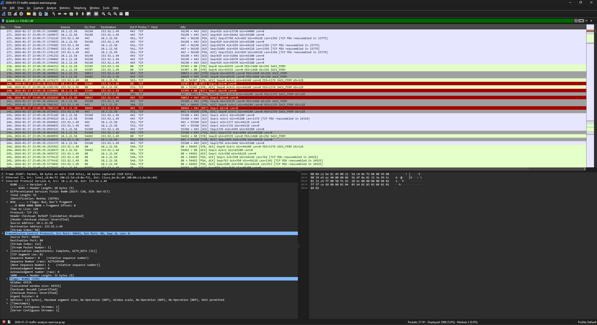
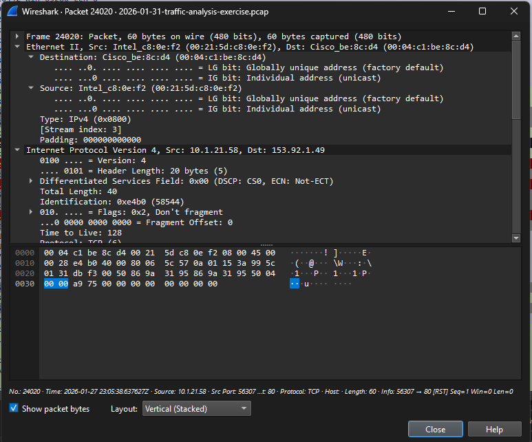
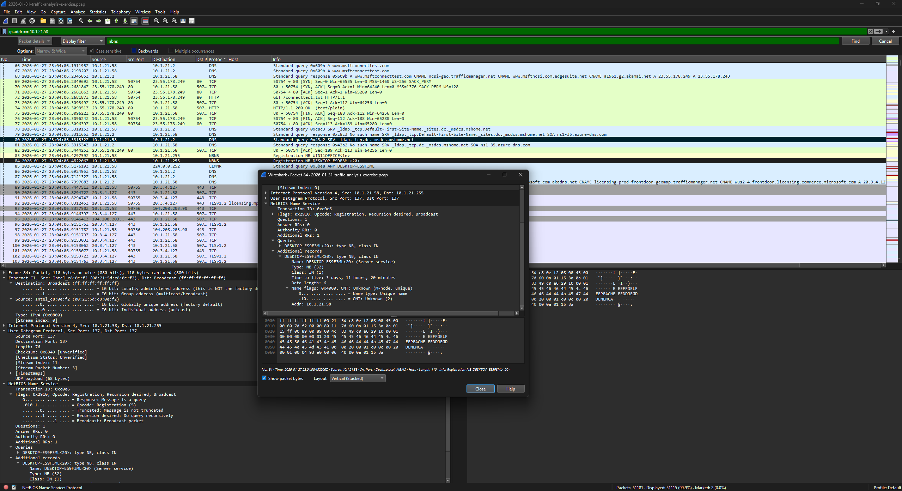
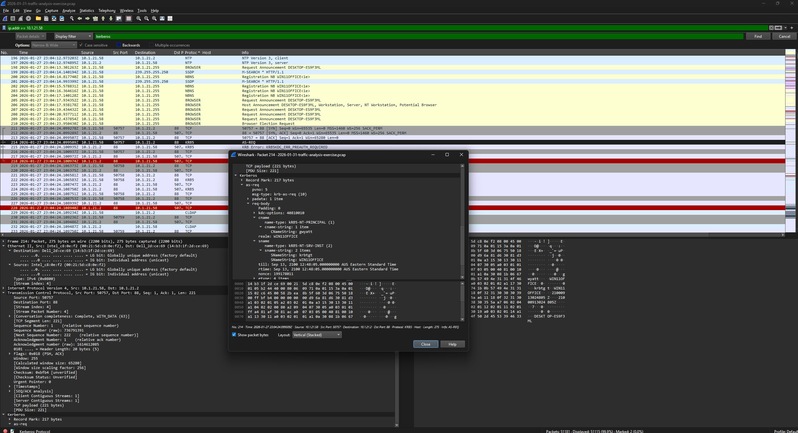
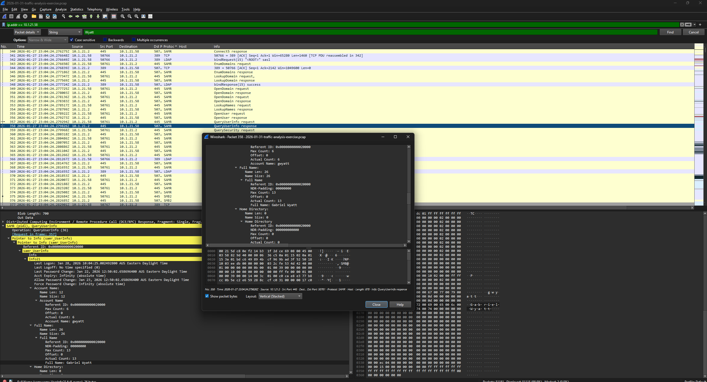
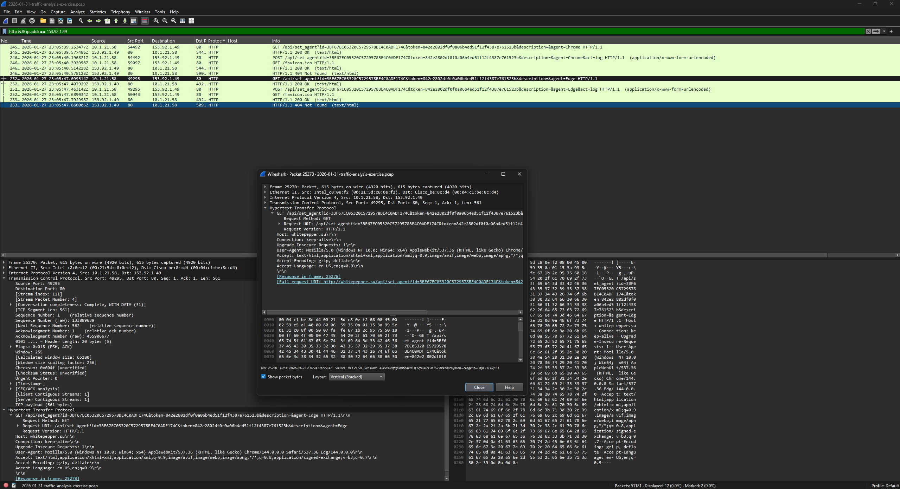

# Incident Report — Lumma Stealer Activity

## Summary
Network traffic analysis identified a compromised Windows endpoint communicating with Lumma Stealer infrastructure.

## Detection
Alert triggered for Lumma Stealer fingerprinting activity on outbound traffic to 153.92.1.49.

## Impacted Asset
- Host: DESKTOP-ES9F3ML
- IP: 10.1.21.58
- User: Gabriel Wyatt (gwyatt)

## Evidence
- NetBIOS/SMB revealed hostname
- Kerberos authentication revealed user identity
- DNS/HTTP traffic linked malicious infrastructure domain

## Recommended Response
- Isolate affected endpoint
- Reset user credentials
- Scan system for malware persistence
- Monitor network for repeat connections

## Evidence Screenshots

### Malicious IP Pivot

### Host Attribution (MAC Address)

### Hostname Identification

### User Attribution

### Full Name Artifact

### Malicious Domain Resolution

