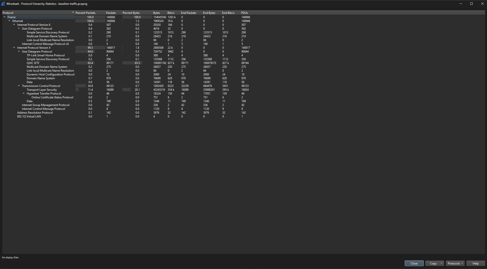
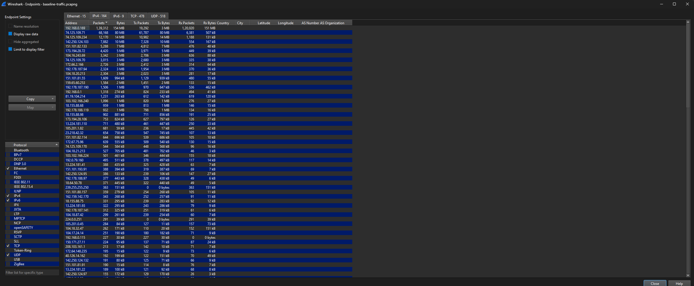
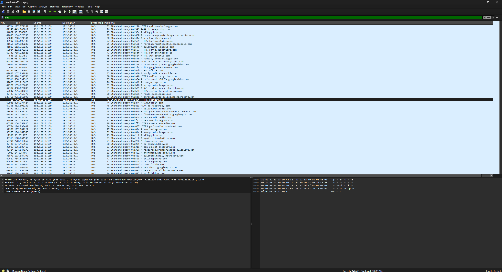

# Network Analysis Walkthrough

## Objective
Analyse normal and malicious network traffic to understand baseline behaviour and identify indicators of compromise.

---

## Part 1: Baseline Traffic Analysis

A packet capture of normal browsing activity was analysed to understand expected network patterns.

### Observations
- Majority of traffic was encrypted (TLS/QUIC)
- DNS requests corresponded to legitimate domains (Google, YouTube, Wikipedia, etc.)
- Traffic heavily utilised CDN infrastructure
- No suspicious beaconing or anomalous protocols observed

### Conclusion
The capture reflects typical modern web usage dominated by encrypted HTTPS/QUIC traffic.

---

## Part 2: Malicious Traffic Investigation

An alert for Lumma Stealer fingerprinting activity triggered on traffic to **153.92.1.49**.

### Investigation Steps
1. Pivoted on the malicious IP address
2. Identified internal host communicating with infrastructure
3. Extracted host identity via NetBIOS/SMB
4. Retrieved user identity via Kerberos artifacts
5. Identified domain resolving to malicious IP

### Attribution Findings
- Infected Host IP: **10.1.21.58**
- Hostname: **DESKTOP-ES9F3ML**
- MAC Address: **00:21:5d:c8:0e:f2**
- User Account: **gwyatt**
- Full Name: **Gabriel Wyatt**
- Malicious Domain: **whitepepper.su**

### Conclusion
The capture confirms a compromised Windows endpoint communicating with Lumma Stealer infrastructure. The host and user identity can now be escalated for remediation.

## Baseline Evidence

